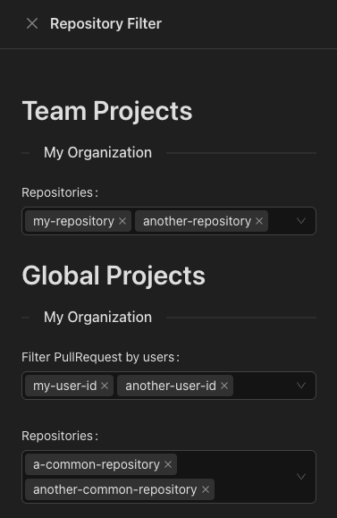

# Github Dashboard

## Generate a github token

Go to https://github.com/settings/tokens, and generate a classic token with the scope `repo`

⚠️ If you want to access organization repository, you might need to configure SSO 

You can now duplicate the `.env` file as `.env.local` and set the variable `VITE_GITHUB_TOKEN` with your token 

## Start 

```bash
npm install
npm run dev
```

## Configuration

For each organization, there are two types of repository you can add :
1. Team Repos: you will see all the PullRequest for this repository
2. Global Repos: you will see the PullRequest opened by the shortlist of user

To add a repo, fill the input from one of the categories with its name (organization prefix excluded)

Example : 

